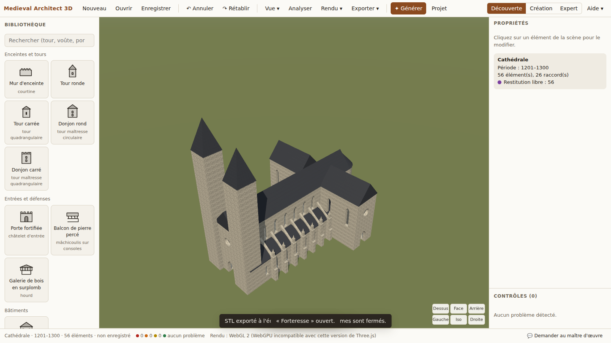

# Medieval Architect 3D

Atelier de création, de génération et de vérification d'architecture médiévale en 3D : châteaux, forteresses, églises et cathédrales. Il tourne dans le navigateur, sans installation pour l'utilisateur final.



**Pour l'installer ou le mettre en ligne : [MISE-EN-PLACE.md](MISE-EN-PLACE.md).**

## Ce qu'il fait

- **Construire à la main**, pièce par pièce : 18 modules paramétriques (murs, tours, donjons, porte fortifiée, logis, nef, transept, abside, chapelles, colonnes, arcs, voûtes, contreforts et arcs-boutants, mâchicoulis, hourds), qui s'aimantent les uns aux autres.
- **Générer à partir d'une phrase** : *« une forteresse royale du XIIIe siècle, quatre tours rondes, un donjon, une double enceinte »*. L'application montre ce qu'elle a compris et supposé, puis le résultat en fantôme. Rien n'est ajouté sans validation, et le résultat reste entièrement modifiable.
- **Vérifier** : anachronismes, éléments suspendus, collisions, murs trop percés, élancement excessif, voûtes sans appui ou sans contrebutement. Chaque problème est expliqué (pourquoi, quel risque) et peut être corrigé après aperçu.
- **Conseiller** : l'assistant « Maître d'œuvre » répond sur l'élément sélectionné.
- **Enregistrer et exporter** : fichier `.medieval3d`, image PNG jusqu'en 4K, modèle GLB, fichier STL pour l'impression 3D, rapport imprimable.

État détaillé, mesures et limites : [docs/bilan-mvp.md](docs/bilan-mvp.md).

## Organisation du code

| Dossier | Contenu |
|---|---|
| `packages/core` | Modèle de données : schémas, opérations réversibles (annuler/rétablir), bibliothèque de modules et de matériaux, règles de diagnostic, format de fichier |
| `packages/geometry` | Générateurs paramétriques sur le noyau manifold-3d (solides toujours fermés), cache |
| `packages/generation` | Phrase en français → spécification → modules placés et raccordés |
| `apps/studio` | L'application (Three.js, WebGPU avec repli WebGL 2) |
| `apps/prototype` | Prototype technique du lot 0, conservé pour ses mesures |
| `docs/` | Conception technique, compte rendu du lot 0, bilan du MVP |

```bash
npm install
npm run dev        # http://localhost:5173
npm test           # 199 tests
npm run e2e        # 18 scénarios dans Chromium
```

Cahier des charges d'origine : [docs/cahier-des-charges.docx](docs/cahier-des-charges.docx).
