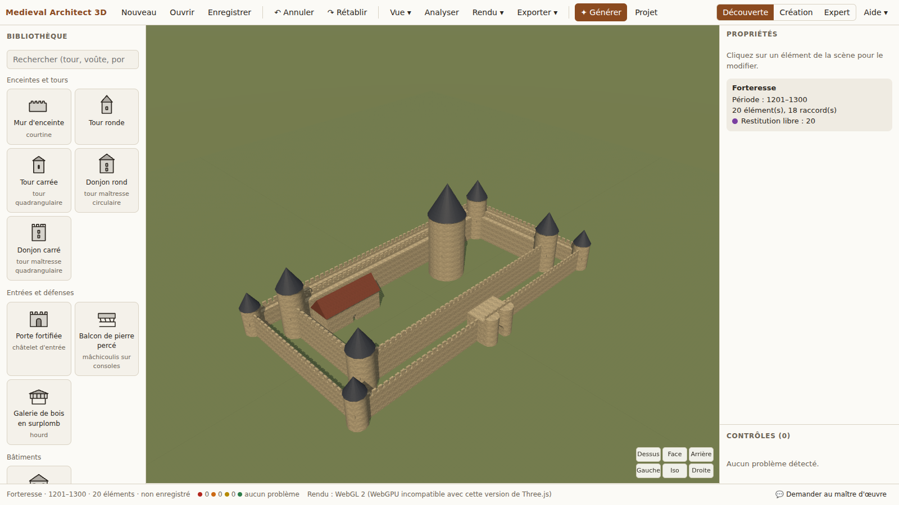

# Bilan du MVP

État au 26 septembre 2026. Référence : liste des 27 fonctions du §25 du cahier des charges, et critères d'acceptation du §26.

## Les 27 fonctions du MVP

| # | Fonction | État | Remarque |
|---|---|---|---|
| 1 | Scène 3D et caméra libre | fait | Orbite, déplacement latéral, zoom, double-clic pour cadrer |
| 2 | Vues orthographiques et grille | fait | Dessus, face, arrière, gauche, droite, iso ; perspective ou orthographique |
| 3 | Sélection et transformations | fait | Déplacement et rotation (autour de la verticale seulement) |
| 4 | Saisie numérique simple | fait | Champs en mètres à côté de chaque curseur |
| 5 | Bibliothèque de modules | fait | 18 modules illustrés, recherche, éléments hors période signalés |
| 6 | Mur paramétrique | fait | Talus, crénelage, ouvertures qui s'adaptent à la taille du mur |
| 7 | Tour ronde | fait | Toit conique ou terrasse crénelée, archères, ouverte à la gorge |
| 8 | Tour carrée | fait | Toit pyramidal, flèche ou terrasse |
| 9 | Porte | fait | Châtelet avec passage voûté, tours de flanquement en option |
| 10 | Créneaux | fait | Paramètre des murs et des tours |
| 11 | Nef | fait | Bas-côtés, travées, fenêtres hautes et basses, portail et rose |
| 12 | Colonne | fait | Base, fût, chapiteau roman ou gothique |
| 13 | Arc | fait | Plein cintre, brisé, surbaissé |
| 14 | Voûte | fait, simplifiée | Berceau, arêtes, croisée d'ogives ; voûtains cylindriques (voir limites) |
| 15 | Contrefort | fait | À ressauts, avec arc-boutant et pinacle en option |
| 16 | Matériaux PBR | partiel | Couleur et appareillage procéduraux, rugosité ; pas de cartes de relief |
| 17 | Transparence | fait | Curseur d'opacité |
| 18 | Vue filaire | fait | Plus : matériau neutre, structure porteuse seule, vue Analyse |
| 19 | Sauvegarde / chargement | fait | Format `.medieval3d` (ZIP), empreintes, vignette, autosauvegarde et reprise |
| 20 | Export PNG | fait | 1080p, 1440p, 4K ou personnalisé ; fond transparent |
| 21 | Export GLB | fait | Plus : STL pour impression 3D (1:50 à 1:500), rapport imprimable |
| 22 | Annuler / rétablir | fait | 500 niveaux (100 minimum garantis par test) |
| 23 | Duplication | fait | Ctrl+D, copie placée à côté de l'original |
| 24 | Aimantation | fait | Grille 0,5 m / 15° ; points d'accroche vert / orange / rouge |
| 25 | Diagnostic architectural de base | fait | 12 règles : 4 historiques, 4 architecturales, 4 structurelles |
| 26 | Assistant simple | fait | Hors ligne, à règles ; propose des corrections en fantôme |
| 27 | Génération contrainte d'un petit édifice | fait | Châteaux et églises, du phrasé libre au modèle éditable |

Hors liste, mais demandé ailleurs dans le cahier des charges et fait : écran d'accueil (§2.2), trois niveaux d'interface Découverte / Création / Expert (§2.1), vocabulaire double (§2.5), « En savoir plus » (§22.2), tutoriel (§2.5), niveaux de certitude documentaire (§16.1), silhouette humaine pour l'échelle (§17), thème clair et sombre.

## Critères d'acceptation (§26)

| Critère | Vérifié ? | Comment |
|---|---|---|
| Un débutant construit un petit château sans manuel | **non vérifié** | Il faut un test avec de vraies personnes. Le tutoriel et l'accueil sont prêts. |
| Manipulation courante à la souris, sans coordonnées | oui | Ajout au centre de la vue, glisser, aimantation, curseurs |
| Erreurs expliquées en langage accessible | oui | Format PROBLÈME / POURQUOI / RISQUE / SOLUTIONS pour chaque règle |
| Fonctions avancées absentes du mode débutant | oui | Paramètres « expert » masqués ; certitude et mécanique hors mode Découverte |
| Modèles générés par IA éditables et paramétriques | oui | La génération produit des modules ordinaires, modifiables comme les autres |
| Au moins une image finale et un export 3D | oui | PNG, GLB, STL testés de bout en bout |
| Faits, plausibilités et hypothèses distingués | oui | Verdicts compatible / atypique / improbable / inconnu ; l'IA ne peut rien marquer « attesté » |
| Niveaux de certitude conservés | oui | Dans le fichier, le GLB (métadonnées) et le rapport |
| Scène fluide sur des projets réalistes | **à mesurer sur GPU** | Voir « Mesures » |

## Tests

| Ensemble | Nombre | Ce qu'il garantit |
|---|---|---|
| Noyau (`packages/core`) | 92 | Schémas, opérations réversibles, 12 règles de diagnostic (chacune a au moins un cas qui la déclenche ; les plus sujettes aux fausses alertes ont aussi un cas qui ne doit pas la déclencher), fichier `.medieval3d` |
| Géométrie (`packages/geometry`) | 87 | Pour chacun des 18 modules : paramètres tirés au hasard dans leurs bornes → solide toujours fermé ; connecteurs déclarés ; matériaux cohérents ; niveau de détail allégé jamais plus lourd |
| Génération (`packages/generation`) | 20 | Les deux exemples du cahier des charges analysés correctement ; sept demandes générées sans collision, sans élément suspendu, sans alerte critique |
| Bout en bout (`apps/studio/e2e`) | 18 scénarios | L'application pilotée dans Chromium comme par un utilisateur : ajout, réglage, annulation, duplication, aimantation, correction d'un anachronisme, génération, analyse, assistant, enregistrement, réouverture, quatre exports |

Les tests par propriétés ont trouvé **sept vrais défauts** pendant le développement, tous corrigés : un connecteur dans le vide (tour ouverte à la gorge), une extrusion écrasée par une particularité de manifold-3d (un facteur `1` lu comme `[1, 0]`), une colonne trapue sans fût, un mur dévoré par sa porte, un logis aux murs plus épais que lui, des chapelles rayonnantes qui se chevauchaient, un analyseur qui lisait « chapelles *rayonnantes* » comme le style gothique *rayonnant*.

## Mesures

Conteneur sans carte graphique, Chromium 141, rendu logiciel. Les temps de calcul géométrique sont significatifs ; les images par seconde ne le sont pas.

| Mesure | Forteresse (exemple du cahier) | Cathédrale (exemple du cahier) |
|---|---|---|
| Éléments générés | 20 | 56 |
| De « Valider » à la géométrie complète | 0,2 à 0,4 s | 0,2 à 0,3 s |
| Géométries distinctes calculées | — | 9 pour 56 éléments |
| Triangles affichés | — | environ 19 000 |

Poids de l'application : 1,2 Mo compressé au premier chargement (Three.js 246 Ko, application 100 Ko, noyau géométrique WASM 208 Ko), puis en cache.

## Optimisations en place

1. **Rendu à la demande** : aucune image n'est recalculée quand rien ne bouge (économie de batterie et de ventilateur).
2. **Ombres recalculées seulement quand la scène change**, et cadrées sur l'édifice.
3. **Géométries partagées** : les éléments identiques (vingt voûtes, trente piles) utilisent une seule géométrie en mémoire.
4. **Calcul en arrière-plan** : jusqu'à quatre workers calculent la géométrie ; l'interface ne se fige jamais.
5. **Caches à deux niveaux** : dans les workers (solides) et dans l'interface (maillages prêts à afficher), avec libération des entrées inutilisées.
6. **Niveaux de détail** : les éléments courbes ont une version allégée (trois fois moins de segments) affichée de loin.
7. **Normales pliées à 35°** : des tours lisses avec peu de segments, des arêtes vives là où il en faut.
8. **Textures sans fichier** : dessinées au lancement, aucune image à télécharger.
9. **Découpage du code** : exportateurs GLB/STL chargés seulement quand on exporte ; Three.js dans un fichier séparé, gardé en cache d'une version à l'autre.
10. **Diagnostics différés** : recalculés 250 ms après la dernière modification, pas à chaque mouvement.

## Limites connues, sans détour

1. **Voûtes simplifiées.** Les voûtains sont des portions de cylindre et les ogives des nervures approchées. C'est juste à l'œil et pour la logique des charges, pas pour la stéréotomie.
2. **Pas de déambulatoire.** Demandé dans l'exemple de cathédrale, il n'est pas modélisé : les chapelles se greffent directement sur l'abside. L'écran de génération le signale.
3. **Transept simplifié.** Les bras sont accolés à la nef ; le mur de la nef n'est pas ouvert à la croisée (visible en mode transparent).
4. **Relief non géré.** L'éperon rocheux est compris et noté, mais le terrain reste plat.
5. **Analyseur de phrases à règles.** Il comprend le vocabulaire courant de l'architecture médiévale, pas les tournures inattendues. Il dit ce qu'il n'a pas compris au lieu d'inventer. Un modèle de langage pourra le remplacer sans rien changer d'autre.
6. **Assistant à règles.** Six familles de questions ; au-delà, il répond qu'il ne sait pas.
7. **Données historiques non sourcées.** Les fourchettes de dates sont des ordres de grandeur. Tant qu'un castellologue ne les a pas relues, le contrôle historique reste indicatif, et le rapport le dit.
8. **Matériaux PBR partiels.** Couleur, appareillage et rugosité ; pas encore de cartes de relief ni de vieillissement visuel.
9. **Structure : niveau 1 seulement.** Ratios d'élancement, appuis des voûtes, contrebutement. Pas encore de ligne de poussée calculée (niveau 2) ni de solveur (niveau 3).
10. **WebGPU indisponible ici.** Three.js r186 et Chromium 141 sont incompatibles en WebGPU ; l'application le détecte et passe en WebGL 2. Le gain WebGPU reste à mesurer sur une machine récente.
11. **Pas de version de bureau.** L'application tourne dans le navigateur. L'empaquetage Electron recommandé par la conception n'est pas fait : il n'apporte rien tant que l'application web suffit.
12. **Aucun test avec de vrais débutants.** C'est le critère le plus important du cahier des charges, et il ne se vérifie pas par un programme.

## Suite proposée

Par ordre d'utilité pour l'utilisateur :

1. Test avec cinq débutants (critère n° 1) et corrections d'ergonomie.
2. Relecture de la base historique par un spécialiste ; renseigner les sources.
3. Terrain éditable (éperons, pentes, fossés).
4. Niveau 2 structurel : lignes de poussée des arcs et voûtes.
5. Plans et coupes cotés (§17).
6. Déambulatoire et vrai transept ouvert.
7. Mode photo réaliste (tracé de chemins).
