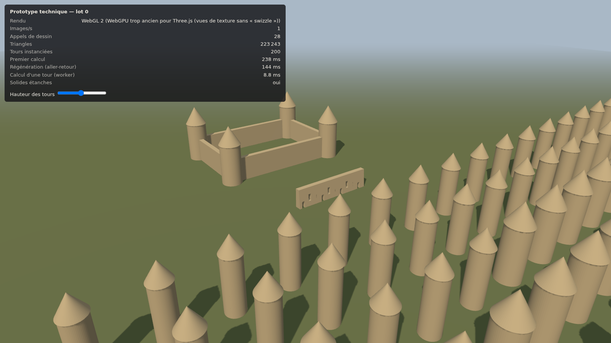

# Lot 0 — Prototype technique

Objet : vérifier la pile proposée (§1.3 de la conception) avant d'écrire l'application.
Code : `packages/geometry`, `apps/prototype`. Mesures : `npm run bench -w @ma3d/prototype`.

## Ce qui a été construit

- **Adaptateur de noyau** (`packages/geometry/src/kernel.ts`) : les générateurs ne voient que `Scope`, jamais manifold-3d. Chaque génération libère ses solides intermédiaires. Le tas WASM n'est pas géré par le ramasse-miettes, et une fuite y serait invisible jusqu'au plantage.
- **Deux générateurs** : mur droit (talus, ouvertures en plein cintre, rectangulaires, archères) et tour ronde (fût creux, sol, toit conique, gorge ouverte, archères radiales). Tous deux renvoient leurs connecteurs résolus.
- **Cache géométrique** : clé = générateur + version + définition + paramètres **résolus** + ouvertures. Une valeur explicite égale au défaut partage l'entrée du défaut. Un calcul raté ne reste pas en cache.
- **Worker de géométrie** : tout le calcul hors du fil principal ; les tableaux sont transférés, pas copiés.
- **Scène** : Three.js r186 (`WebGPURenderer`), 200 tours en 4 variantes instanciées, une enceinte de 4 tours et 4 courtines, un mur de démonstration percé de 10 ouvertures, un curseur qui régénère les tours comme le ferait une poignée.

## Résultats

Machine de mesure : conteneur sans GPU, Chromium 141 sans interface, rendu **logiciel** (SwiftShader).

| Critère (conception §10) | Cible | Mesuré | Verdict |
|---|---|---|---|
| Calcul d'une tour dans le worker | < 50 ms | 6 à 9 ms | **atteint** |
| Mur à 10 ouvertures étanche | oui | oui (et 10 tours, 4 courtines, 4 variantes) | **atteint** |
| Instanciation : 200 tours | peu d'appels de dessin | 28 appels pour toute la scène, ombres comprises | **atteint** |
| Régénération des 4 variantes, aller-retour | fluide sous la poignée | 20 à 30 ms ; 144 ms quand le fil principal est saturé par le rendu logiciel | **à remesurer sur GPU** |
| ≥ 60 images/s avec 200 tours | 60 | 1 à 5 | **non mesurable ici** : rendu logiciel |
| Même rendu sur les trois OS | — | un seul OS testé | **non vérifié** |

Tests automatisés du paquet géométrie : 15, dont deux tests par propriétés qui construisent 100 murs et tours aux paramètres tirés au hasard dans les bornes, et vérifient à chaque fois l'étanchéité et la position des connecteurs sur la surface.

## Ce que le prototype a appris

1. **WebGPU dépend de la version exacte du navigateur.** Three.js r186 passe à chaque vue de texture une option (`swizzle`) que Chromium 141 refuse : l'écran reste vide, une exception par image. Le prototype teste maintenant cette compatibilité au démarrage et bascule en WebGL 2. Conséquence pour le choix de la pile : une application qui embarque son propre Chromium (**Electron**) contrôle ce couple de versions ; une webview système (Tauri) le subit. Cela confirme la recommandation de la conception. Il faudra aussi **figer la version de Three.js** et la monter délibérément, avec le test de rendu.
2. **Le test par propriétés a trouvé un défaut dès sa première exécution.** Sur une tour ouverte à la gorge, le connecteur côté cour restait en place, dans le vide. Il est corrigé. Ces tests sont la bonne défense pour les générateurs, qui combinent trop de paramètres pour des cas écrits à la main.
3. **Le noyau est rapide.** manifold-3d construit une tour creuse avec toit et percements en moins de 10 ms. Le coût se trouvera plutôt dans la préparation du maillage pour l'affichage (normales, facettes) et dans les booléens en cascade des voûtes (lot 3).
4. **Une ouverture au ras du sol n'est pas un trou.** Une porte posée au sol entaille le mur sans le traverser de part en part au sens topologique. Le calcul du genre (nombre de trous) le reflète, et les règles de diagnostic devront raisonner sur les ouvertures déclarées, pas sur la topologie du maillage.

## Ce qui reste à faire pour clore le lot 0

- Mesurer images/s et régénération sur **trois machines réelles** avec GPU (Windows, macOS, Linux), avec Electron. Commande : `npm run bench -w @ma3d/prototype -- --headed`, puis joindre `bench/dernier-resultat.json`.
- Empaqueter le prototype dans Electron et vérifier que la version de Chromium embarquée accepte WebGPU avec Three.js r186.
- Réduire le nombre de triangles : 64 segments par tour, c'est trop pour les tours lointaines. Le LOD (§24) doit en proposer 16 à distance.

Tant que ces mesures n'existent pas, le choix Electron + Three.js reste une hypothèse étayée, pas une décision.
